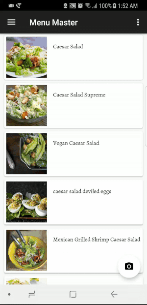
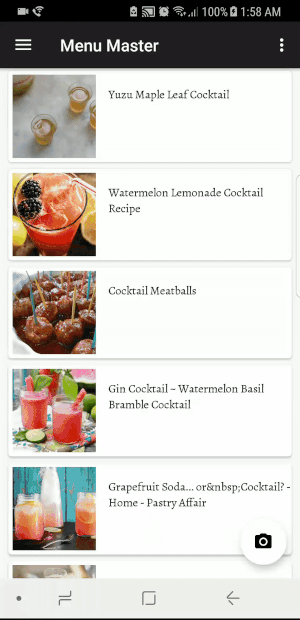

# Menu Master

Imagine you are sitting in a nice restaurant, but you have trouble with the menu because you've never heard of some entree names on it. How awkward and annoying!  
Don't worry, you got Menu Master! This app provides a fast and easy way of helping people to figure out confusing dish names. It uses phone's camera to scan a menu and detect dish names on it. Then you can choose some of those names of interest, the app will show pictures, ingredients, and other useful information for you. Instead of typing and googling, Menu Master gives people a more convenient and rapid way to know dishes' information with just a few clicks.  
Life is short, you need Menu Master :)  

### Features  
* Register and sign in user's account with email or your Google account.
* User can take a photo of one menu, then app will detect texts on it and search those dishes to retrieve useful information.
* User can also type in dish names manually and fetch dish's information.
* App will record user's search history, user can review it when signed in.  
* User can collect dishes of interest, and manage those dishes in MyFaves view. 
* After searching, results will be displayed in list format. Clicking any row of the list will let user enter dish detail view, where user can favor dish and find more information about it. 

### Requirements
* Android phone with camera. 
* MinSdkVersion 21
* TargetSdkVersion 26  

### App Showcase  
1.Google sign in.  
  
  
2.Email sign in.   
  
  
3.Text detection and dish information retrieval.  
   
  
4.Dish search by typing in texts.  
  
  
5.User's history.  
  
  
6.My faves.  
  

### Architecture  
     
